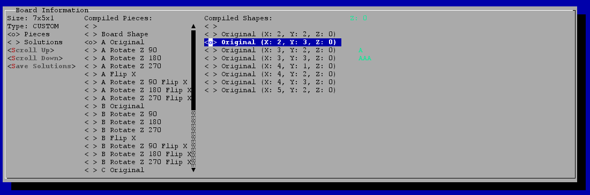
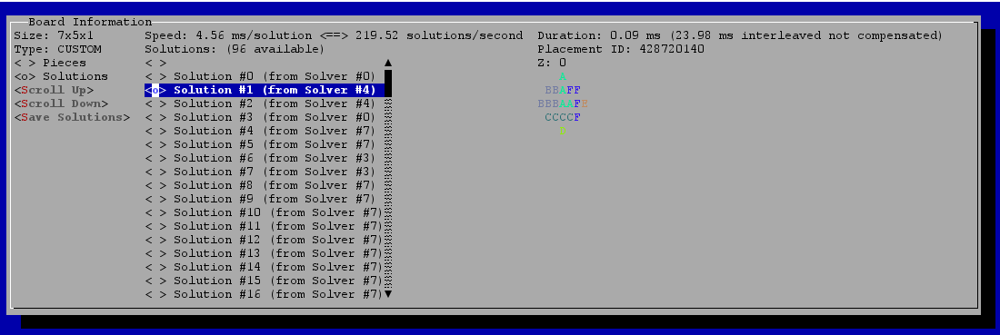
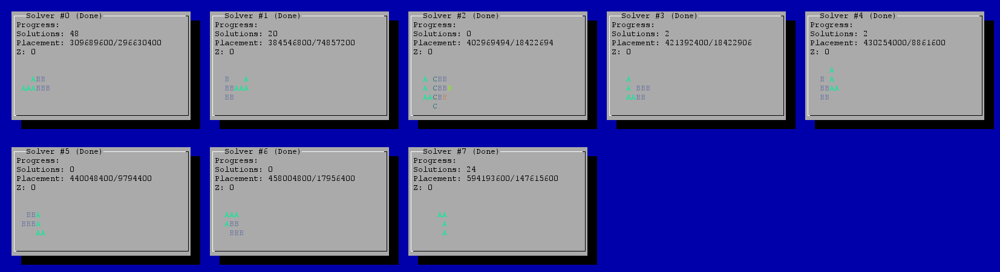
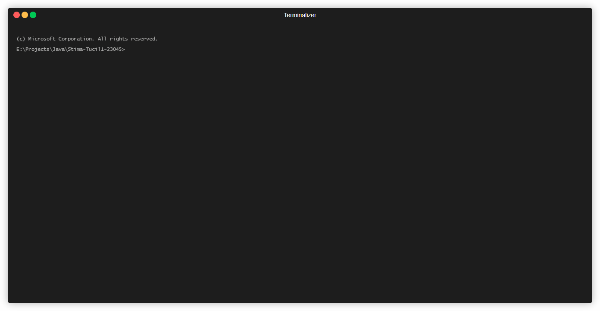

# IQ Puzzler Pro Solver

## Introduction
IQ Puzzler Pro is a board game produced by Smart Games. The objective of the game is for the player to completely fill the board using the given puzzle pieces.

### Game Components
1. **Board** – The main component where players must fit all puzzle pieces to fill the entire area.
2. **Blocks/Pieces** – The unique-shaped puzzle pieces used to fill the board. All blocks must be used to complete the puzzle.

The game starts with an empty board. Players place the puzzle pieces without overlapping (except in the 3D mode). Each puzzle piece can be rotated or mirrored. The puzzle is considered solved only if the board is fully covered using all pieces.

### Assignment
Your task is to find at least one solution for the IQ Puzzler Pro game using a brute-force algorithm. If no solution exists, the application should indicate that no solution was found.

## Features
1. **Solver Branching Support** – The solver is divided into multiple jobs, allowing permutation distribution for efficient solving.
2. **Threading Support** – Solver jobs can run on dedicated threads for parallel processing.
3. **Fast Bit Field** – Utilizes a bit-field storage method for quick comparisons and placements.
4. **Custom Board and Pieces** – Users can provide custom-shaped boards and puzzle pieces.
5. **Case File Support** – The application can load case files and output solutions.
6. **High Performance** – Optimized for speed and efficiency.

## Prerequisites
- Minimum Java version: **21**
- Recommended runtime: **GraalVM**, **RedHat**, or **Eclipse Adoptium**

## Running the Application
1. Download the latest release JAR file from: [GitHub Releases](https://github.com/NadhifRadityo/Stima-Tucil1-23045/releases)
2. Run the application by either:
   - Double-clicking the JAR file
   - Running the command:  
     ```sh
     java -jar Stima-Tucil1-23045.jar
     ```

### Command Line Options
```sh
java -jar Stima-Tucil1-23045.jar [options]

Options:
 -b, --branch <arg>       Number of branches allowed for the solver (default: 8)
 -c, --virtual-console    Enable virtual console mode
 -h, --help               Display help message
 -i, --input <arg>        Specify input case file
 -o, --output <arg>       Specify output file
 -s, --solutions <arg>    Number of solutions to generate (default: 100)
 -t, --thread <arg>       Number of threads to use (default: 2)
 -u, --no-interactive     Disable interactive console mode
```

## Screenshots
|Image|Caption|
|-|-|
||A graphical interface displays board information for a 7x5x1 puzzle with a "CUSTOM" type. It shows compiled pieces and compiled shapes, listing various transformations of piece "A" in different rotations and flips. The highlighted selection is "Original (X: 2, Y: 3, Z: 0)." The interface has a blue background with gray panels and text in different colors.|
||A graphical interface displaying board information related to solutions. The board size is 7x5x1, and the system has found 96 solutions. The interface shows a list of solutions with their solver sources, highlighting "Solution #1 (from Solver #4)." The speed is recorded as 4.56 ms per solution, equating to 219.52 solutions per second. The right panel shows a visual representation of a solution using letters to represent pieces in a grid.|
||A graphical interface showing the status of multiple solvers running in parallel. Eight solver windows are displayed, each showing progress, number of solutions found, and placements attempted. Some solvers have found solutions, while others have not. Each solver window contains text with letters representing puzzle pieces arranged in a grid format.|
||__Non-Interactive UI (Headless)__<br/>A command-line execution of a puzzle solver for a 5×5×1 board using 24 solvers in parallel. The board consists of predefined pieces (A-G) with multiple transformations. The solvers evaluate billions of permutations, incrementally discovering valid solutions. Initial attempts yield no solutions, but later progress shows increasing success rates. The solver status bar visualizes solution discovery percentages across different threads.|

## Development
1. Clone the repository:
   ```sh
   git clone https://github.com/NadhifRadityo/Stima-Tucil1-23045
   ```
2. Build the project using Gradle:
   ```sh
   ./gradlew build
   ```
3. The output JAR file will be located in:
   ```sh
   build/libs/Stima-Tucil1-23045.jar
   ```

## 📝 Milestones
| No | Points | Yes | No |
| --- | --- | --- | --- |
| 1 | Program berhasil dikompilasi tanpa kesalahan  | ✔️ | |
| 2 | Program berhasil dijalankan | ✔️ | |
| 3 | Solusi yang diberikan program benar dan mematuhi aturan permainan | ✔️ | |
| 4 | Program dapat membaca masukan berkas .txt serta menyimpan solusi dalam berkas .txt | ✔️ | |
| 5 | Program memiliki Graphical User Interface (GUI) | ✔️ | |
| 6 | Program dapat menyimpan solusi dalam bentuk file gambar | | ✔️ |
| 7 | Program dapat menyelesaikan kasus konfigurasi custom |✔️|  |
| 8 | Program dapat menyelesaikan kasus konfigurasi Piramida (3D) | | ✔️ |
| 9 | Program dibuat oleh saya sendiri | ✔️ | |
